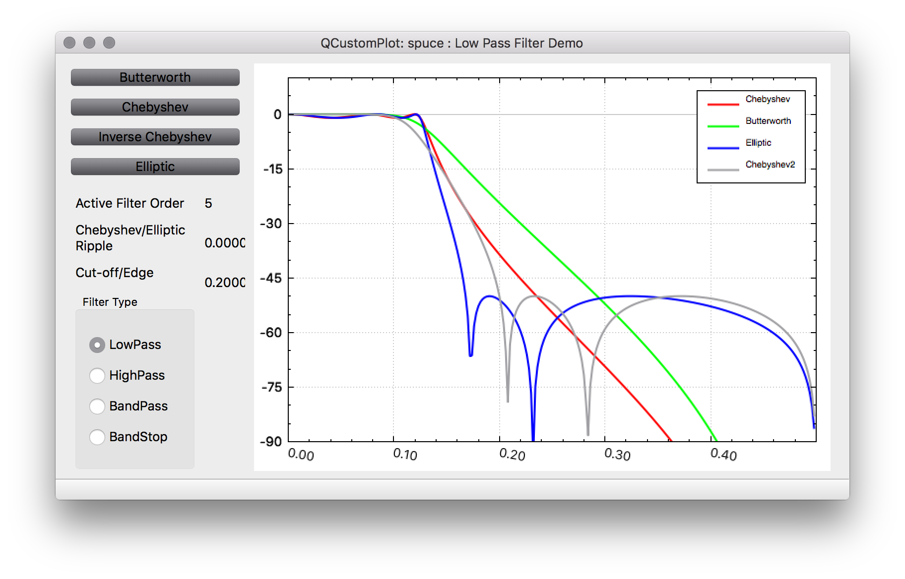
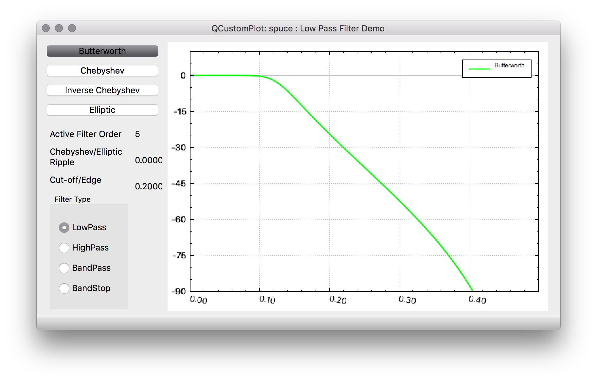
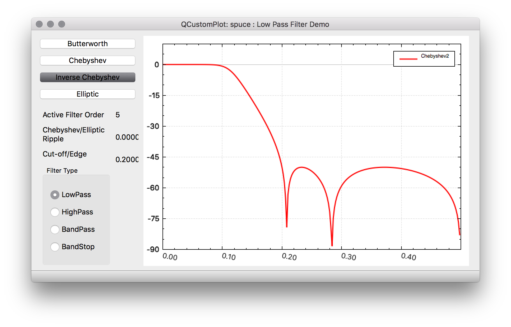
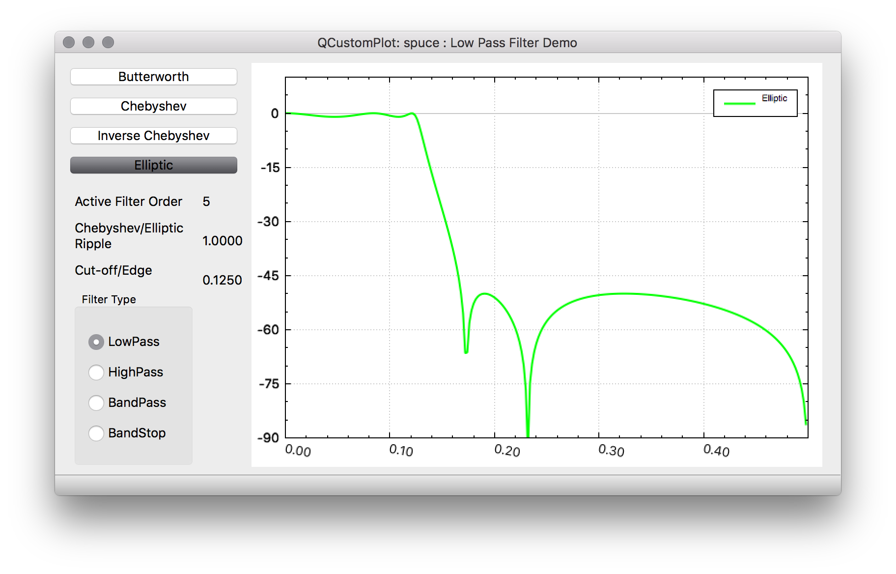
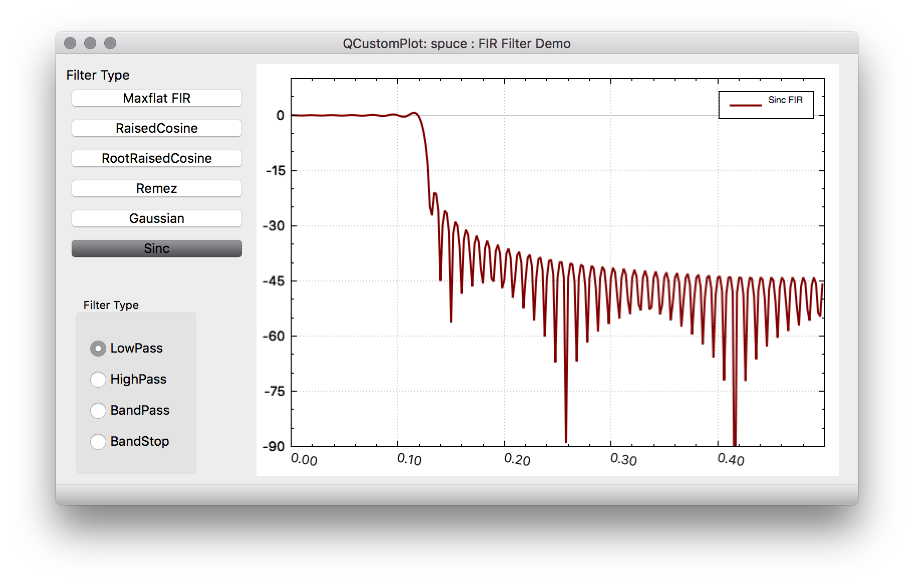
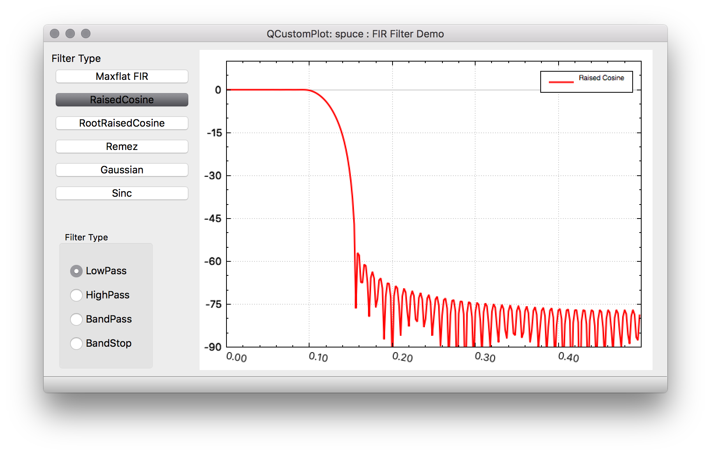
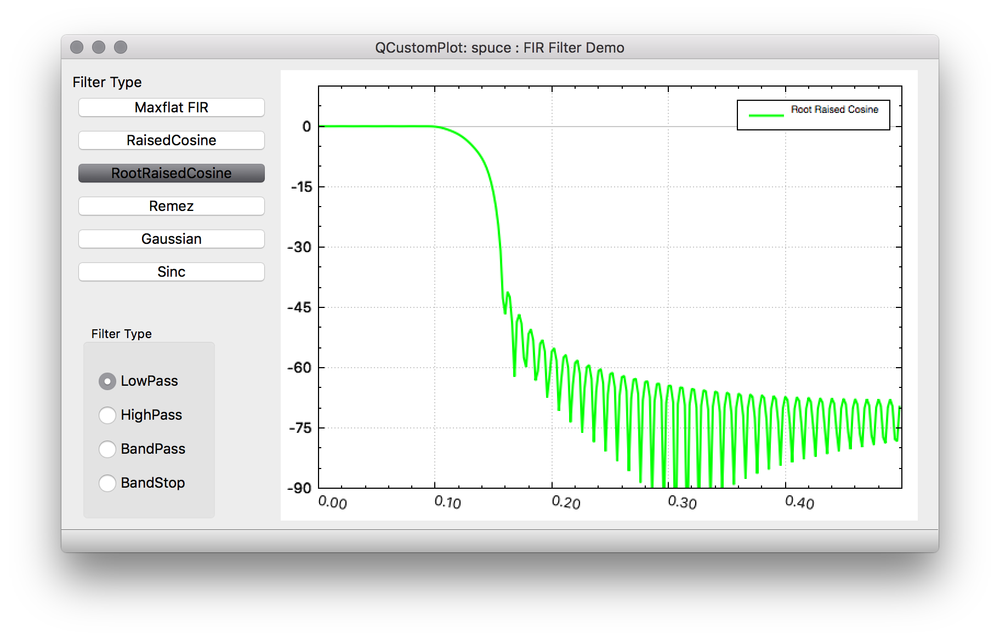
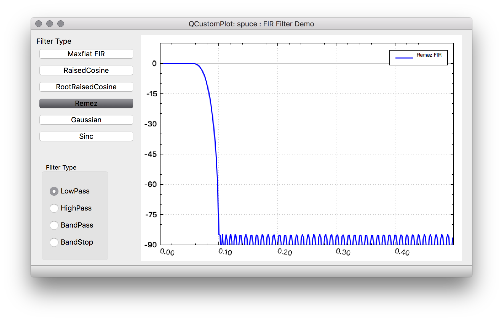
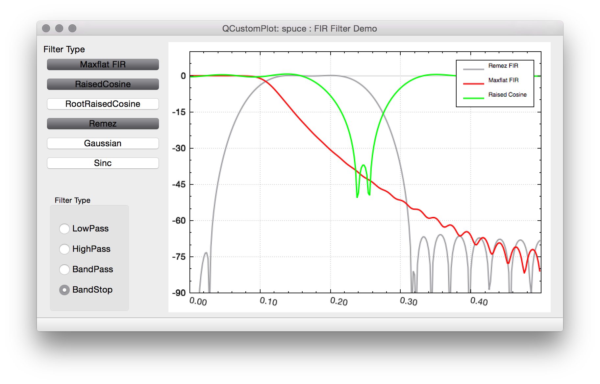

# spuce - A DSP Digital filtering library in C++

- Travis: 
- AppVeyor: 

A rewrite of the digital filter components of SPUC with more testing, better code design and c++11 features.

* Uses std::complex instead of custom complex class
* Will focus of floating point instead of fixed-point modules
* Includes Chebyshev2 filter
* Bug fixes for odd order IIR filters
* Adding support for Bandpass and Bandstop designs for both IIR and FIR filters

Most of spuc was written many years ago before C++ compilers had good template support and was primarily written for fixed-point hardware design and simulation.

Currently there is some code for IIR Filter Design & Implementation

* Butterworth
* Chebyshev
* Inverse Chebyshev
* Elliptic
* Maximally flat FIR
* Remez Equiripple
* Raised Cosine FIR/Root Raised Cosine FIR
* Gaussian FIR
* Sinc FIR
* Cascaded Integrate Comb filters (or CIC filters)
* Notch filter
* Cut/Boost Filter
* Halfband/Subband IIR filters consisting of allpass sections
* Irrational resampling with Farrow & Lagrange based filters

**To install via Homebrew**
* brew tap audiofilter/spuce
* brew install spuce  (or brew install -HEAD spuce for latest sources)

For testing, python + matplotlib is used.

* Most of the test involve using python's matplotlib to show a frequency response of the filter, sometimes impulse responses are used

**There are 4 QT apps for illustration purposes fir_plot, iir_plot, window_plot and other_plot**

QT5 needed for test application

# A Quick Guide to Digital Filters in Spuce

**Using Digital filters in digital signal processing applications**

The intention of this document is to help coders in a practical way on how use effectively design and use digital filters.
The theory of DSP will be kept to a minimum as there are a plethora of books on the subject, here we'll take a more casual and practical approach.
It's assumed the reader either has the DSP background or doesn't need to know that level of detail.

The two most popular types of digital filters are Infinite Impulse Response filters (IIR) and Finite Impulse Response filters (FIR). We will deal with both of these.

# IIR filters

IIR filters are generally based on a digital transformation of analog filtering equations. Again we will not go into theory or much background here. Please see https://en.wikipedia.org/wiki/Infinite_impulse_response.

The most common forms of IIR filters are

* Butterworth
* Chebyshev
* Inverse Chebyshev
* Elliptic
* Bessel

So, when would use decide to use each? And why IIR vs FIR?

To answer the latter first, IIR filters are often more computationally efficient compared to their FIR counterparts. That is to meet a particular frequency specification it is often more efficient to use an IIR. This is even more true in hardware where one is implementing the filter in an ASIC or FPGA and with fixed-point data types. We'll skip the specifics of why for now.

However, there are some drawbacks to IIRs too.
* They are usually not linear phase (i.e. you have group delay distortion).
* Impulses responses are not constrained in time as they are in FIR filters

Given that, let's go over the different IIR variants mentioned above

Firstly the diagram below shows the frequency responses for 4 types of 5th order IIR filters to give a quick overview of their differences

Below discussion will refer to generic low-pass filters. High-pass, band-pass and band-stop filters will be dealt with afterwards.

**Butterworth**
https://en.wikipedia.org/wiki/Butterworth_filter

Butterworth IIRs have a very flat frequency response in the passband and then roll-off in the stopband. They are often referred to as maximally flat magnitude filters. These filters are useful when you don't want to cause much passband distortion and you don't need very sharp cut-off. In addition butterworth filters have monotonically decreasing magnitude with frequency. Due to it's flatness in the passband and gradual roll-off, butterworth IIRs tend to have phase responses in the passband that are closer to linear phase than Chebyshev and Elliptic filters.

A 1st order Butterwoth rolls off at -6dB per octave. The general rule is -6dB per octave per filter order.

**Chebyshev**
https://en.wikipedia.org/wiki/Chebyshev_filter

Chebyshev filters have steeper roll-off than Butterworth filters but also more passband ripple. So in cases where one can tolerate a little more passband distortion at the expense of sharper cut-off they are often preferrable to Butterworth filters. In addition to larger passband amplitude distortion, Chebyshev filters also have larger group delay distortion than Butterworth filters. Like Butterworth filters, Chebyshev filters have monotonically decreasing magnitude with frequency.

**Inverse Chebyshev**
https://en.wikipedia.org/wiki/Chebyshev_filter

Inverse Chebyshev filters are also known as Chebyshev Type II filters and basically have monotonically decreasing amplitude in the passband region and equiripple stopband attenuation. So you'll typically get better stopband performance as a butterworth IIR while maintaining flat passband response. In addition there is no ripple in the group delay response in the passband. 

**Elliptic**
https://en.wikipedia.org/wiki/Elliptic_filter

Elliptic filters has equiripple frequency responses in both the passband and the stopband. Due to this ability, the elliptic filter can have sharper roll-off between the passband and stopband than either Butterworth or Chebyshev filters. Also one can specify a uniform stopband attenuation that is met across the whole stopband rather than having a monotonically decreasing frequency response. This is useful when one wants to specify a particular stopband attenuation that must be met at a particular frequency (and above). For a given order there is a trade-off between the amount of passband ripple and stopband attenuation that one can perform.
One particular difference between Elliptic filters and Chebyshev or Butterworth filters is that the numerator has none simple coefficients requiring real multiplies. This is less of a concern in software than it is for hardware IIR filters where real multipliers are required.

**Bessel (not currently in spuce)**
https://en.wikipedia.org/wiki/Bessel_filter

The Bessel filter has maximally flat group/phase delay rather than frequency magnitude response. The impulse response has less overshoot compared to other IIR filters

To Compare IIR filter directly please build and run *iir_plot*
You can use the mouse to create desired frequency responses and compare directly the different IIR filters.

**High-pass/Band-pass/Band-stop IIR filters**

To design these types of filters, a prototype Low pass filter is first designed and then transformed. Again we will skip theory here, but note that for a prototype low pass filter of order-N, a band-pass or band-stop transformation will double the filter order. Transformations can be done in the s-plane domain or in the z-domain. In Spuce all transformations from s-plane to z-domain are done with the bilinear transformation. High pass filters are designed in the S-plane, while transformations to band-pass or band-stop are done after the bilinear transform in the z-domain.
For IIR filters, the band-pass and band-stop filters still have real coefficients and are symmetric in the frequency domain.

# FIR filters

The most common types of FIR filters are

* Equiripple or Remez FIR filters
* Gaussian FIR
* Raised Cosine FIR
* Root Raised Cosine FIR
* Box-Car/Sinc (or sin(x)/x) FIR

in addition in Spuce is a

* Maximally flat FIR

**Box-Car/Sinc FIR**
https://en.wikipedia.org/wiki/Sinc_filter

This perhaps the easiest FIR to use in design of defining the tap values. This filter that has an ideal frequency response of a rectangular function that removes all frequency components above a given cutoff frequency. The impulse response is a sinc (sin(x)/x) function. However, this ideal response can never be accomplished since the Fourier series of this brick-wall response is not realizable, being a non-causual infinite response.
So the Sinc FIR is a truncated version of the Sinc function in the time domain. In addition to the side-effects of truncating the series, this filter suffers from the Gibbs pheonomoen such that the 1st sidelobe in the stopband region is only 13 dB down and further sidelobes trail off in magnitude slowly

**Gaussian FIR**
https://en.wikipedia.org/wiki/Gaussian_filter

The gaussian filter is unique in that it's frequency domain response and time domain response both have the same shape. i.e a Gaussian function.
These filters have no overshoot to a step function and also minimize the rise and fall time. There are similar to Bessel filters in that they have the minimum possible group delay. The gaussian function itself is infinite so the FIR is a truncated version of the function. Gaussian filters are probably most often used in GFSK and GMSK modems.

**Raised Cosine**
https://en.wikipedia.org/wiki/Raised-cosine_filter

This filter has frequently been used in digital communications due to the fact that it limits the spectrum effectively while at the same time ideally giving no intersymbol interference between data symbols. The frequency response consists of a flat passband portion, a `cosine` portion and a stopband portion. It actually describes a family of FIR filters in that the amount of excess bandwidth (over an ideal response) can be controlled by an excess bandwidth factor which can vary from 0 to 1. A factor of 1 means that the frequency response has a pure cosine shape and 100% excess bandwidth, while 0 is essentially a brick-wall filter. This is often used outside of digital communication because it is also relatively easy to calculate the impulse response as there are closed form function equations available for the range of excess bandwidth factors (but again for practical purposes we truncate the infinite impulse responses).

**Root Raised Cosine**
https://en.wikipedia.org/wiki/Root-raised-cosine_filter

This filter is also used in digital communications and comes from the fact that if the overall channel filter response of raised-cosine filtering is desired, the ideal matched filters would be a square-root raised cosine since it's desired to have the same filtering for both transmit and receive chains. So the overall filtering would be raised-cosine and individually you'd have the square root of the frequency response for individual reponses of transmit and receive. There is also closed from equations for an ideal impulse response that is typically truncated to the desired length.

**Remez**
https://en.wikipedia.org/wiki/Parks%E2%80%93McClellan_filter_design_algorithm

Although commonly called Remez filters, these filters are typically designed by the Parks-McCellan algorithm. Unlike other FIRs already mentioned these filters are not truncated versions of an ideal response but are computationally designed for a particular length. This algorithm minimizes the error to an ideal frequency response by utilizing a variation of the Remez exchange algorithm. For a given brick-wall filter desired frequency response, the Remez filter often does the best job in approximating the ideal response.

**Transformations for FIR filters**

Transforming low-pass FIR filters to high-pass, band-pass and band-stop filters are a little easier in general for FIR filters than IIR filters. For example to transform a low-pass FIR to high pass FIR, one can multiple every other coefficient by -1. If however, you have a low-pass filter with cut-off frequency fc, this will result in a high-pass filter with a cut-off of fs/2 - fc, where fs is the sampling frequency.

Tranforming to a band-pass filter, is basically done by multiplying taps by a cosine function. Compared to IIR filter transformation, doubling of the frequency order is not required. In addition to band-pass filters, there is a notion of complex band-pass filters. These are generally band-pass filters that also filter out either all negative or position frequencies, although you can also just specify upper and lower cut-off frequencies anywhere between -fs/2 and fs/2. In these cases, rather than multiplying by a cosine function, you multiply by a complex exponential. The net result for a complex band-pass filter is you end up with a FIR filter that has complex taps instead of real taps. This increases the computational complexity considerably since a complex multiply typically contains 4 real multiplies.

For band-stop filters there are basically two options, although there is a standard formula to do the transformation. That is, to create a band-pass filter first and then subtract 1 from the middle tap and finally invert all the resulting coefficients. The effectively gives you 1 - bandpass response which results in a band-stop filter.

Another method is to design a high-pass filter and then transform it up in frequency by either a cosine for a real band-pass filter or an exponential cosine for a complex band-pass filter.

Transformations of the 1st kind for band-stop filters are based on symmetrical odd-order FIR filters and will not work for other types. The second method, however, doesn't have this requirement.

# QT Apps

