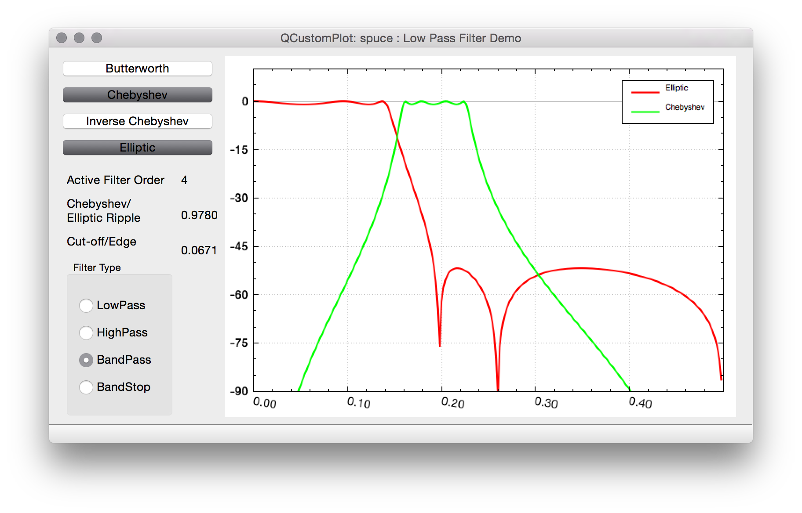
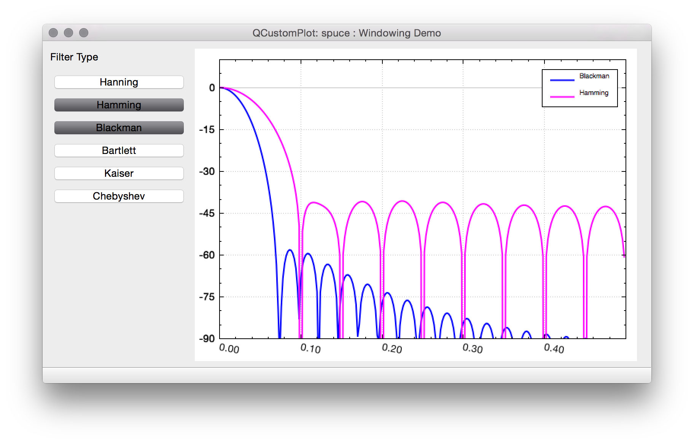

# spuce - SPUC enhanced

- Travis: 
- AppVeyor: 

A rewrite of the digital filter components of SPUC with more testing, better code design and c++11 features.

* Uses std::complex instead of custom complex class
* Will focus of floating point instead of fixed-point modules
* Includes Chebyshev2 filter
* Bug fixes for odd order IIR filters
* Adding support for Bandpass and Bandstop designs for both IIR and FIR filters

Most of spuc was written many years ago before C++ compilers had good template support and was primarily written for fixed-point hardware design and simulation.

Currently there is some code for IIR Filter Design & Implementation

* Butterworth
* Chebyshev
* Inverse Chebyshev
* Elliptic
* Maximally flat FIR
* Remez Equiripple
* Raised Cosine FIR/Root Raised Cosine FIR
* Gaussian FIR
* Sinc FIR
* Cascaded Integrate Comb filters (or CIC filters)
* Notch filter
* Cut/Boost Filter
* Halfband/Subband IIR filters consisting of allpass sections
* Irrational resampling with Farrow & Lagrange based filters

**To install via Homebrew**
* brew tap audiofilter/spuce
* brew install spuce  (or brew install -HEAD spuce for latest sources)

For testing, python + matplotlib is used.

* Most of the test involve using python's matplotlib to show a frequency response of the filter, sometimes impulse responses are used

QT5 needed for test application

